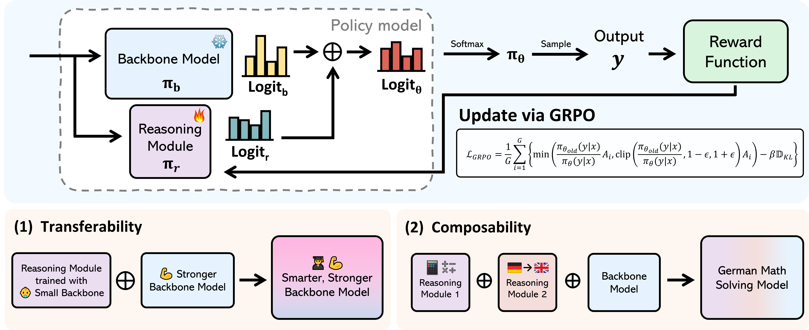

# Universal Reasoner: A Single, Composable Plug-and-Play Reasoner for Frozen LLMs

This repository hosts the code and datasets for the **UniR** project, accompanying the paper [*Universal Reasoner: A Single, Composable Plug-and-Play Reasoner for Frozen LLMs*](https://arxiv.org/abs/2505.19075). 



Overview: UniR is a lightweight, plug-and-play reasoning module that enables modular, reward-driven reasoning enhancements for any frozen LLM, achieving strong generalization and composability without retraining the backbone.


## Datasets
Datasets can be downloaded from the below links and should be placed under the` ./data` directory.
- [GSM8k](https://huggingface.co/datasets/openai/gsm8k)
- [Math12k](https://huggingface.co/datasets/hiyouga/math12k)


## Installation
Our codebase is based on [TRL](https://huggingface.co/docs/trl/index) and [open-rs](https://github.com/knoveleng/open-rs) for training. Run the following to set up the environment:

Set up a virtual environment with Python 3.11:
```
conda create -n unir python=3.11
conda activate unir
pip install --upgrade pip
conda install -c nvidia cuda-nvcc
pip install vllm==0.7.2 
pip install setuptools
pip install flash-attn --no-build-isolation
pip install bitsandbytes
pip install -e ".[dev]"
pip install peft datasets pylatexenc tensorboardx
```

## Training

Train models using a YAML config with 2 GPUs (set `num_processes=2`):

- GSM8K (Qwen)
```bash
ACCELERATE_LOG_LEVEL=info accelerate launch \
  --config_file recipes/accelerate_configs/zero2.yaml \
  --main_process_port 6667 \
  --num_processes=2 \
  train.py \
  --config recipes/unir.yaml \
  --dataset_name dataset/gsm8k \
  --dataset_config default \
  --output_dir run/GSM8k-llama-backbone3b_reasoning1b \
  --run_name GSM8k-llama-backbone3b_reasoning1b \
  --ref_name_or_path Qwen/Qwen2.5-3B-Instruct \
  --model_name_or_path Qwen/Qwen2.5-0.5B-Instruct \
  --num_generations 8 \
  --per_device_eval_batch_size 8 \
  --per_device_train_batch_size 8 \
  --max_completion_length 1024 \
  --max_steps 1000 \
  --save_steps 100 \
  --beta 0.0 \
  --system_prompt "A conversation between User and Assistant. The user asks a question, and the Assistant solves it. The assistant first thinks about the reasoning process and answer are enclosed within <think> </think> and <answer> </answer> tags, respectively. Your response should be in the following format: <think>\nYour reasoning here\n</think>\n<answer>\n answer here \n</answer>. The reasoning process Note that respond by English, NOT use other languages." \
  --reward_funcs rule_based_accuracy \
  --reward_weights 1.0
```

- Math12k (Qwen)
```bash
ACCELERATE_LOG_LEVEL=info accelerate launch \
  --config_file recipes/accelerate_configs/zero2.yaml \
  --main_process_port 6667 \
  --num_processes=2 \
  train.py \
  --config recipes/unir.yaml \
  --dataset_name dataset/math12k \
  --dataset_config default \
  --output_dir run/GSM8k-qwen-backbone3b_reasoning05b \
  --run_name GSM8k-qwen-backbone3b_reasoning05b \
  --ref_name_or_path Qwen/Qwen2.5-3B-Instruct \
  --model_name_or_path Qwen/Qwen2.5-0.5B-Instruct \
  --num_generations 8 \
  --per_device_eval_batch_size 4 \
  --per_device_train_batch_size  4 \
  --max_completion_length 2048 \
  --max_steps 1000 \
  --save_steps 100 \
  --beta 0.0 \
  --system_prompt "A conversation between User and Assistant. The user asks a question, and the Assistant solves it. The assistant first thinks about the reasoning process and answer are enclosed within <think> </think> and <answer> </answer> tags, respectively. Your response should be in the following format: <think>\nYour reasoning here\n</think>\n<answer>\n\boxed{{your answer here}}\n</answer>." \
  --reward_funcs boxed_reward \
  --reward_weights 1.0
```

## Evaluation

For single-GPU setups:

- GSM8K (Qwen)
```bash
CHECKPOINT_ROOT="checkpoint"
CONFIG="recipes/unir.yaml"
SCRIPT="src/unir/evaluate.py"
mkdir -p "$CHECKPOINT_ROOT/output_log"
dataset_index=4

for ckpt_num in $(seq 100 100 1000); do
    LOG_PATH="${CHECKPOINT_ROOT}/output_log/checkpoint-${ckpt_num}_dataset_${dataset_index}"
    python "$SCRIPT" \
    --config "$CONFIG" \
    --dataset_config default \
    --per_device_eval_batch_size 1 \
    --num_generations 1 \
    --max_completion_length 1024 \
    --gradient_checkpointing false \
    --model_name_or_path Qwen/Qwen2.5-0.5B-Instruct \
    --ref_name_or_path Qwen/Qwen2.5-3B-Instruct \
    --eval_checkpoint "$CHECKPOINT_ROOT"/checkpoint-$ckpt_num \
    --use_vllm false \
    --output_dir "$LOG_PATH" \
    --run_name unir_test \
    --reward_funcs rule_based_accuracy \
    --reward_weights 0.5 \
    --temperature 0.0 \ #Automatically set do_sample to False when temp is zero.
    --beta 0.0 \
    --dataset_index $dataset_index \
    --system_prompt "A conversation between User and Assistant. The user asks a question, and the Assistant solves it. The assistant first thinks about the reasoning process and answer are enclosed within <think> </think> and <answer> </answer> tags, respectively. Your response should be in the following format: <think>\nYour reasoning here\n</think>\n<answer>\n answer here \n</answer>. The reasoning process Note that respond by English, NOT use other languages." \
    > "${LOG_PATH}.log" 2>&1
done
```

- Math 500 + OOD Benchmarks

To evaluate models trained on Math12k, we use four benchmarks: Math500 , Minerva, AIME 2024, and OlympiadBench, to assess generalization to advanced math problems.

```bash

CHECKPOINT_ROOT="checkpoint"
CONFIG="recipes/unir.yaml"
SCRIPT="src/unir/evaluate.py"
mkdir -p "$CHECKPOINT_ROOT/output_log"
for ckpt_num in $(seq 100 100 1000); do
  for dataset_index in 0 1 2 3; do
      LOG_PATH="${CHECKPOINT_ROOT}/output_log/checkpoint-${ckpt_num}_dataset_${dataset_index}"
      python "$SCRIPT" \
      --config "$CONFIG" \
      --dataset_config default \
      --per_device_eval_batch_size 1 \
      --num_generations 1 \
      --max_completion_length 2048 \
      --gradient_checkpointing false \
      --model_name_or_path Qwen/Qwen2.5-0.5B-Instruct \
      --ref_name_or_path Qwen/Qwen2.5-3B-Instruct \
      --eval_checkpoint "$CHECKPOINT_ROOT"/checkpoint-$ckpt_num \
      --use_vllm false \
      --output_dir "$LOG_PATH" \
      --run_name unir_test \
      --reward_funcs boxed_reward \
      --reward_weights 0.5 \
      --temperature 0.0 \ #Automatically set do_sample to False when temp is zero.
      --dataset_index $dataset_index \
      --system_prompt "A conversation between User and Assistant. The user asks a question, and the Assistant solves it. The assistant first thinks about the reasoning process and answer are enclosed within <think> </think> and <answer> </answer> tags, respectively. Your response should be in the following format: <think>\nYour reasoning here\n</think>\n<answer>\n\boxed{{your answer here}}\n</answer>." \
      > "${LOG_PATH}.log" 2>&1
    done
done

```


## Acknowledgements

- We thank the Hugging Face team for their contributions through [open-r1](https://github.com/huggingface/open-r1) and [trl](https://github.com/huggingface/trl), which served as the foundation for our trainer and evaluation pipeline.
- We also acknowledge the [open-rs](https://github.com/knoveleng/open-rs) project for providing additional utilities and reference implementations that inspired parts of this repository.

Parts of the code have been adapted and customized to support the UniR framework and its reinforcement learning components.

## Citation
If this project aids your work, please cite it as:

```
@article{UniversalReasoner2025,
  title={Universal Reasoner: A Single, Composable Plug-and-Play Reasoner for Frozen LLMs},
  author={Jaemin Kim, Hangeol Chang, Hyunmin Hwang, Choonghan Kim, Jong Chul Ye},
  journal={arXiv preprint arXiv:2505.19075},
  year={2025}
}
```
